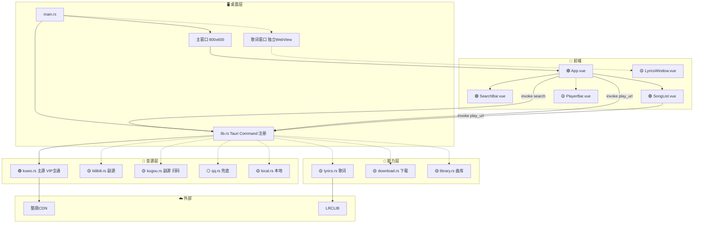

# 米豆音乐 — ARCHITECTURE.md

> 功能地图 v1.0 — 全景（2026-07-22）
> 修改代码前必须查此地图，确认影响范围。
> 图例：🟢 已实现 · 🟡 计划中 · ⚪ 远期预留

---

## 全景图（Mermaid）



---

## 通信方式（唯一）

```
前端 Vue          Tauri IPC               Rust 后端
─────────         ────────                ─────────
invoke('search',  ───────────►  #[tauri::command]
  { keyword })                  fn search(...)
                  ◄───────────  Vec<Song>

invoke('play_url',──────────►  #[tauri::command]
  { songId })                   fn play_url(...)
                  ◄───────────  { url }

<audio src="https://cdn..."   ← 酷我 CDN 直连，不经代理
```

没有 warp、没有 HTTP 路由、没有额外端口。

---

## 桌面层

### main.rs 🟢
| 字段 | 值 |
|------|-----|
| 路径 | `src-tauri/src/main.rs` |
| 行数 | 10 |
| 规则 | 官方生成，不改 |

### lib.rs 🟢
| 字段 | 值 |
|------|-----|
| command | `search(keyword) → Vec<Song>` 🟢 |
| command | `play_url(song_id) → PlayUrlResult` 🟢 |
| command | `lyric(song_id) → String` 🟡 |
| command | `download(song_id, path) → bool` 🟡 |
| command | `scan_library() → Vec<Song>` 🟡 |

### 窗口
| 标签 | 用途 | 状态 |
|------|------|------|
| `main` | 搜索 + 列表 + 播放器 | 🟢 |
| `lyrics` | 独立歌词浮窗 | 🟡 |

---

## 音源层

| 文件 | 角色 | 登录 | VIP | 状态 |
|------|------|------|-----|------|
| `kuwo.rs` | **主源** | 零Cookie | ✅ 全通 | 🟢 |
| `bilibili.rs` | 副源 | 访客buvid3/4 | ✅ 音频流DASH | 🟡 |
| `kugou.rs` | 副源 | 扫码登录 | ⚠️ 需token | 🟡 |
| `qq.rs` | 兜底 | 暂缓 | ❌ 48% | ⚪ |
| `local.rs` | 本地补充 | — | — | 🟡 |

### kuwo.rs 🟢
| 端点 | 地址 | 用途 |
|------|------|------|
| 搜索 | `search.kuwo.cn/r.s` | 关键词搜索 |
| 播放 | `mobi.kuwo.cn/mobi.s` | 获取VIP直链 |
| 歌词 | `mobi.kuwo.cn/mobi.s` | 内置歌词字段 |

### bilibili.rs 🟡
| 端点 | 地址 | 用途 |
|------|------|------|
| 搜索 | `api.bilibili.com/x/web-interface/search` | WBI签名搜索 |
| 播放 | `api.bilibili.com/x/player/playurl` | DASH音频流 fnval=4048 |
| 歌词 | `lrclib.net/api/get` | 回退LRCLIB |

### kugou.rs 🟡
| 步骤 | 端点 | 用途 |
|------|------|------|
| 设备注册 | `login.service.kugou.com` | RSA+AES 设备ID |
| 扫码登录 | `login.user.kugou.com` | WebSocket 扫码 |
| 搜索 | `songsearch.kugou.com` | 关键词搜索 |
| 播放 | `trackercdn.kugou.com` | 获取URL（需token） |
| 收藏同步 | `collect.user.kugou.com` | 拉取歌单列表 |

---

## 能力层

| 文件 | 功能 | 输入 | 输出 | 状态 |
|------|------|------|------|------|
| `lyrics.rs` | 歌词获取 | song_id, artist, title | LRC 文本 | 🟡 |
| `download.rs` | 下载管理 | song_id, path | 文件路径 | 🟡 |
| `library.rs` | 本地曲库 | 扫描根目录 | Vec<Song> | 🟡 |

**歌词回退链**: 酷我内置 → LRCLIB → 空

---

## 前端

| 组件 | 功能 | 状态 |
|------|------|------|
| `App.vue` | 根组件，调 invoke | 🟢 |
| `SearchBar.vue` | 搜索输入 emit | 🟢 |
| `SongList.vue` | 歌曲列表 prop | 🟢 |
| `PlayerBar.vue` | 进度条、暂停、上下首 | 🟡 |
| `LyricsWindow.vue` | LRC滚动歌词、换源 | 🟡 |
| `SettingsPanel.vue` | 主题、音源开关、下载路径 | 🟡 |

---

## 外部服务

| 服务 | 用途 | 状态 |
|------|------|------|
| 酷我CDN | 音频直连（`<audio src=...>`） | 🟢 |
| LRCLIB | 公开歌词 API | 🟡 已验证 |
| B站 upos | DASH 音视频流 | 🟡 已验证 |

---

## 数据流

### 搜索→播放（🟢 已实现）
```
输入 "晴天"
  → SearchBar emit('search', '晴天')
  → App.vue invoke('search', { keyword: '晴天' })
  → lib.rs → kuwo.rs::search()
  → reqwest GET search.kuwo.cn
  → 解析 → Vec<Song>
  → SongList 渲染

点击第1首
  → SongList emit('play', song)
  → App.vue invoke('play_url', { songId })
  → lib.rs → kuwo.rs::play_url()
  → { url: "https://..." }
  → <audio src="https://..." />
```

### 下载（🟡 计划）
```
点击下载
  → invoke('download', { songId, path })
  → lib.rs → download.rs
  → reqwest GET CDN URL → 流写磁盘
  → 返回文件路径
```

### 歌词（🟡 计划）
```
播放歌曲
  → invoke('lyric', { songId, artist, title })
  → lib.rs → lyrics.rs
  → 尝试 kuwo 内置 → 失败则 LRCLIB
  → 返回 LRC 文本
  → LyricsWindow 渲染滚动
```

---

## 目录结构（对齐 Tauri 官方）

```
midou-music/
├── src/                    Vue 前端
│   ├── main.ts
│   ├── App.vue
│   ├── style.css
│   └── components/
│       ├── SearchBar.vue
│       ├── SongList.vue
│       ├── PlayerBar.vue     🟡
│       └── LyricsWindow.vue  🟡
│
├── src-tauri/              Rust 后端
│   ├── Cargo.toml
│   ├── tauri.conf.json
│   └── src/
│       ├── main.rs
│       ├── lib.rs
│       └── platform/        音源适配器
│           ├── mod.rs
│           ├── kuwo.rs       🟢
│           ├── bilibili.rs  🟡
│           ├── kugou.rs     🟡
│           ├── qq.rs        ⚪
│           └── local.rs     🟡
│
├── docs/                   文档
│   ├── 编制规则_v1.md
│   ├── 研发计划.md
│   └── 验收_v0.1.0_20260722.md
│
├── test-pages/             独立测试
└── ARCHITECTURE.md         本文件
```

---

## 验证状态 (2026-07-22 14:33)

| 检查项 | 状态 |
|--------|------|
| `cargo check` | ✅ |
| `npm run build` | ✅ |
| `npx tauri icon` | ✅ |
| `npx tauri dev` | ✅ |
| 酷我搜索+播放 | ✅ 米豆确认能听歌 |
| GitHub 远端 | ✅ https://github.com/ccpker/midou-music |

---

## 修订记录

| 日期 | 版本 | 说明 |
|------|------|------|
| 2026-07-22 | v0.1.0 | 初始（warp 架构） |
| 2026-07-22 | v0.1.1 | 废弃 warp → Tauri IPC |
| 2026-07-22 | v0.1.2 | 验收通过，能听歌 |
| 2026-07-22 | v1.0 | 全景地图 — 完整功能蓝图 |
