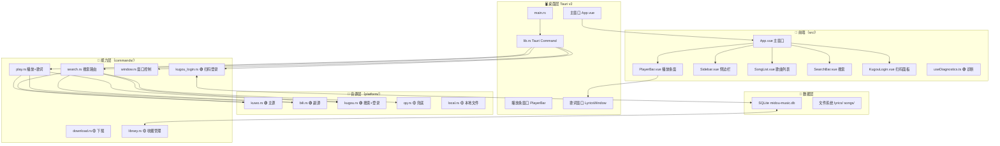

# 米豆音乐 — ARCHITECTURE.md

> 功能地图 v1.3 — 全景（2026-07-25）
> 修改代码前必须查此地图，确认影响范围。
> 图例：🟢 已实现 · 🟡 计划中 · ⚪ 远期预留

---

## 全景图（Mermaid）



---

## 主窗口布局

```
┌──────────────┬──────────────────────────────────────┐
│ 🎵 米豆音乐  │  🔍 搜索歌曲...         📥  ⚙       │
│              │  ──────────────────────────────────  │
│ ▾ 酷我       │                                      │
│    搜索      │  ┌─ 主面板（按侧边栏切换）─────────┐  │
│    电台      │  │  搜索结果                       │  │
│    推荐歌单  │  │  歌单详情                       │  │
│    排行榜    │  │  网络收藏某一类                  │  │
│              │  │  本地收藏某一类                  │  │
│ ▾ B站音频    │  │  设置 / 队列                    │  │
│    搜索      │  └────────────────────────────────┘  │
│    排行榜    │                                      │
│ ▸ B站视频   │                                      │
│ ▸ QQ         │                                      │
│ ▸ 酷狗       │                                      │
│              │                                      │
│ ──────────  │                                      │
│ ♡ 网络收藏  │                                      │
│ 📂 本地收藏 │                                      │
│   设置      │                                      │
└──────────────┴──────────────────────────────────────┘
```

---

## 侧边栏完整结构

### 一级 1 — 各源（全部可展开二级）

| 一级 | 二级内容 |
|------|---------|
| 酷我 | 搜索 / 电台 / 推荐歌单 / 排行榜 |
| B站音频 | 搜索 / 排行榜 |
| B站视频 | 搜索 / 排行榜 |
| QQ | 搜索 / 排行榜 |
| 酷狗 | 搜索 / 排行榜 |

### 一级 2 — ♡ 网络收藏

- 🎵 酷我收藏
  - ♥ 喜欢（默认）
  - 📁 用户自建分类
- 📺 B站音频收藏
  - ♥ 喜欢（默认）
  - 📁 用户自建分类
- 🐶 酷狗收藏
  - ♥ 喜欢（默认）
  - 📁 用户自建分类
- 💚 QQ收藏
  - ♥ 喜欢（默认）
  - 📁 用户自建分类

### 一级 3 — 📂 本地收藏

- 📁 全部歌曲（默认）
  - 右键菜单：
    - 🔄 **同步本地**（扫描下载文件夹 + 用户手动添加的文件夹）
    - 📂 打开文件夹
    - 📁 建子分类
    - ⚙ 设置下载路径
- 📁 用户自建分类
  - 右键菜单：
    - 📁 建子分类
    - ✏️ 重命名
    - 🗑️ 删除分类（歌曲不删）
    - ❌ 从分类移除（只移出，不删文件）

### 一级 4 — 设置

---

## 播放条窗口（独立小窗 · 置顶悬浮）

```
┌──────────────────────────────────┐
│  🎵 晴天 - 周杰伦       🎤  ⋯  ✕ │  ← 可拖动
├──────────────────────────────────┤
│  ━━━━●━━━━━━━━━  1:23 / 4:29    │
├──────────────────────────────────┤
│  ⏮   ⏸   ⏭   🔊──●──  队列≡   │
└──────────────────────────────────┘
```

**点 🎤 → 歌词窗从上方弹出，贴合成"花生"**：

```
┌──────────────────────────────────┐
│  ⏺ 歌词                  ↻ 换源 ✕│
│                                  │
│  > 阳光洒在                       │
│  > 你脸庞                         │
│                                  │
├──────────────────────────────────┤
│  🎵 晴天 - 周杰伦        🎤  ⋯  ✕│
│  ━━━━●━━━━━━━━━  1:23 / 4:29    │
│  ⏮   ⏸   ⏭   🔊──●──  队列≡   │
└──────────────────────────────────┘
```

**关歌词 → 播放条滑回原位**。

---

## 收藏与播放逻辑

### 网络收藏
- **存储**：仅 `song_id` + `source` + `category`
- **播放**：`play_url(song_id, source)` 实时拉取
- **不依赖本地文件**

### 本地收藏
- **入库**：下载完成后自动 scan → 入"全部歌曲"
- **播放**：`play_url(song_id, source='local')` 读本地文件路径
- **分类**：用户自建分类，歌曲可属多分类

---

## 本地歌词系统

### 匹配逻辑

| 场景 | 匹配方式 |
|------|----------|
| 下载歌曲时 | 自动保存同名 .lrc 到同目录 |
| 同步本地时 | 扫描同目录 /lyrics/ 文件夹，文件名匹配歌曲名 |
| 手动指定 | 用户手动关联歌词文件 |

### 本地歌词编辑器

播放本地歌曲时可编辑：

```
┌──────────────────────────────────────┐
│  📝 编辑歌词 — 晴天.lrc        💾 ✕ │
├──────────────────────────────────────┤
│  偏移量                              │
│  [-0.3s] [-0.1s] [+0.1s] [+0.3s]    │
│  当前偏移: +0.1s                     │
├──────────────────────────────────────┤
│  [00:12.00] 故事的小黄花             │
│  [00:17.50] 从出生那年就飘着         │
│  [00:21.30] 童年的荡秋千             │
│  ▶ [00:25.10] 随记忆一直晃到现在    │ ← 当前行
│  [00:29.80] ─────────────────────   │ ← 可拖动
│  [00:34.20] ...                      │
├──────────────────────────────────────┤
│  💾 保存   ☐ 同时回传 LRCLIB 改善歌词│
└──────────────────────────────────────┘
```

**编辑能力**：
- ⏱ **全局偏移**：+0.1s / +0.3s / -0.1s / -0.3s（解决音频不同步）
- ✏️ **行级微调**：点击某行时间手动输入纠正
- 📝 **纯文本编辑**：直接改歌词文字
- 💾 **保存**：写回 .lrc 文件（不依赖网络）
- ☐ **回传 LRCLIB**：勾选后同步 POST 到公开歌词库

### 匹配流程

```
播放本地歌曲
  → 查找同名 .lrc（同目录 或 同目录/lyrics/）
  → 有 → 加载，显示编辑入口
  → 无 → 提示"未找到歌词，手动指定 / 下载歌词"
  → 编辑后 → 保存到 .lrc 文件
```

---

## 节点详情

### lib.rs command 清单
| command | 功能 | 状态 |
|---------|------|------|
| `search(keyword, source, page)` | 搜索 | 🟢 |
| `play_url(song_id, source)` | 获取播放 URL | 🟢 |
| `kugou_qr_key` | 生成二维码 key | 🟢 |
| `kugou_qr_check(key)` | 轮询扫码状态 | 🟢 |
| `kugou_auth_status` | 查询登录状态 | 🟢 |
| `kugou_save_qr_token(token,userid)` | 保存 token | 🟢 |
| `kugou_logout` | 退出登录 | 🟢 |
| `lyric(song_id, source)` | 获取歌词 | 🟡 |
| `download(song_id, path)` | 下载 | 🟡 |
| `scan_library(folder)` | 扫描本地文件 | 🟡 |
| `favorite_add(song, category)` | 添加网络收藏 | 🟡 |
| `favorite_list(source, category)` | 收藏列表 | 🟡 |
| `local_list(folder)` | 本地文件列表 | 🟡 |
| `category_create(name, type)` | 创建分类 | 🟡 |
| `lyric_save(song_id, lrc_text, offset)` | 保存本地歌词 | 🟡 |
| `lyric_match(song_id)` | 匹配本地歌词 | 🟡 |

### 数据库表（🟡）
```sql
favorites_net (id, song_id, source, category, added_at)
favorites_local (id, file_path, title, artist, album, duration, category, added_at)
categories (id, name, type ('net'|'local'))
lyrics_local (id, song_id, file_path, offset, modified_at)
```

---

## 验证状态（2026-07-25）

| 检查项 | 状态 | 备注 |
|--------|------|------|
| `cargo check` | ✅ | |
| `npm run build` | ✅ | |
| `npx tauri icon` | ✅ | |
| 酷我搜索+播放 | ✅ | 米豆确认能听歌（07-22） |
| B站搜索+播放 | ✅ | DASH音频 |
| 酷狗扫码登录 | ✅ | Rust 自建，零代理（07-24） |
| 酷狗播放 | ❓ | 搜到歌但播不了，待诊断 |
| 全链路诊断 | ✅ | 🏥 紫色按钮 |
| GitHub | ✅ | ccpker/midou-music main+legacy |

---

## 修订记录

| 日期 | 版本 | 说明 |
|------|------|------|
| 2026-07-22 | v1.2 | 本地歌词编辑系统 · 同步本地 · LRC偏移 |
| 2026-07-25 | v1.3 | 修正架构图（Tauri IPC，kugou_login模块，B站音源），更新验证状态 |
