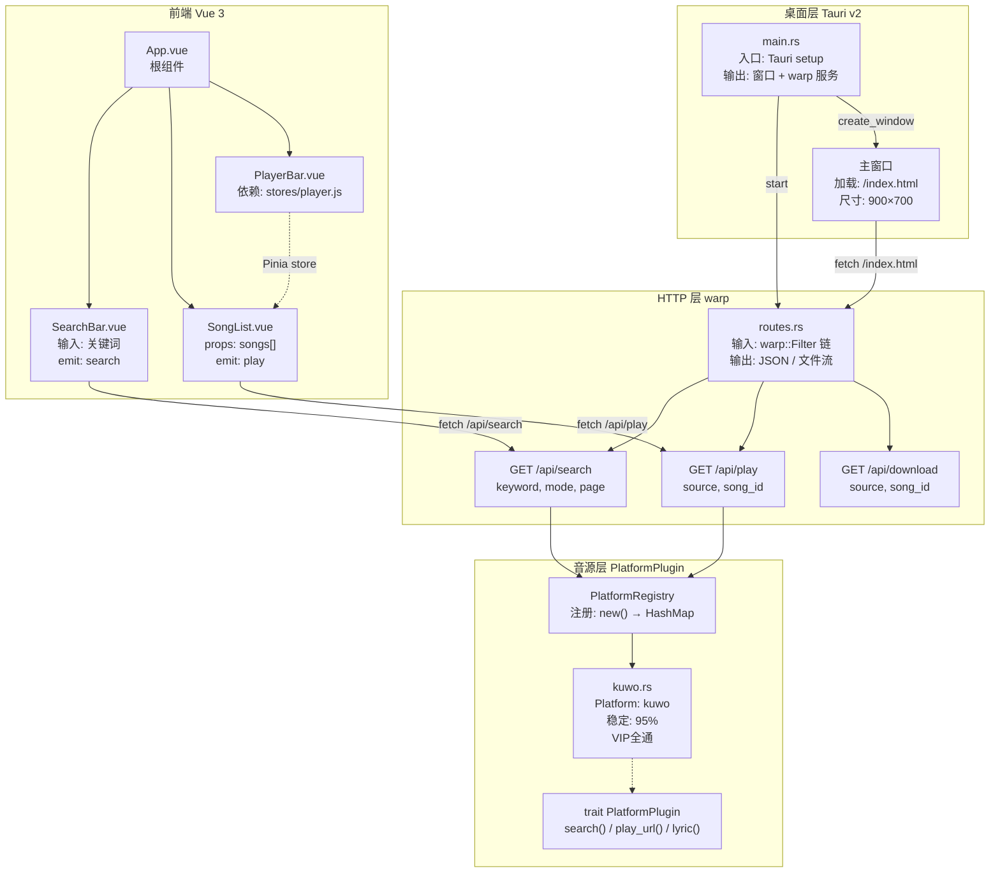

# 米豆音乐 — ARCHITECTURE.md

> 功能地图 v0.1.0（2026-07-22）
> 修改代码前必须查此地图，确认影响范围。

---

## 整体架构（Mermaid）



---

## 节点详情

### 1. main.rs
| 字段 | 值 |
|------|-----|
| 路径 | `src-tauri/src/main.rs` |
| 输入 | 无（程序入口） |
| 输出 | Tauri App（窗口 + warp 服务） |
| 依赖 | routes.rs, platform/*, tauri, warp |
| 测试 | 无（集成测试：cargo run） |
| 注 | **≤200行**，不含业务逻辑 |

### 2. routes.rs
| 字段 | 值 |
|------|-----|
| 路径 | `src-tauri/src/routes.rs` |
| 输入 | Client, PlatformRegistry, AppConfig |
| 输出 | warp::Filter 链 |
| 依赖 | platform/*, lyrics.rs, download.rs |
| 测试 | `cargo test routes` |
| 注 | **≤300行**，每个路由 ≤30 行 |

### 3. PlatformPlugin trait
| 字段 | 值 |
|------|-----|
| 路径 | `src-tauri/src/platform/mod.rs` |
| 接口 | `search(kw,page) → Vec<Song>` `play_url(id) → String` `lyric(id) → String` |
| 实现 | kuwo.rs, kugou.rs, bilibili.rs（渐进迁入） |
| 注 | 新增音源 = 新增 impl PlatformPlugin + 注册到 Registry |

### 4. kuwo.rs
| 字段 | 值 |
|------|-----|
| 路径 | `src-tauri/src/platform/kuwo.rs` |
| 状态 | ✅ 直接迁入，不重写 |
| 接口 | `impl PlatformPlugin` |
| 端点 | mobi.kuwo.cn 车载API |
| 注 | 零Cookie零登录，VIP全通 |

### 5. SearchBar.vue
| 字段 | 值 |
|------|-----|
| 路径 | `frontend/src/components/SearchBar.vue` |
| props | 无 |
| emits | `search(keyword, mode)` |
| 依赖 | 无 |
| 注 | mode 默认 "kuwo" |

### 6. SongList.vue
| 字段 | 值 |
|------|-----|
| 路径 | `frontend/src/components/SongList.vue` |
| props | `songs: Song[]` |
| emits | `play(song)`, `download(song)` |
| 依赖 | 无 |
| 注 | Song 类型：{song_id, name, singer, album, duration, cover_url, source} |

### 7. PlayerBar.vue
| 字段 | 值 |
|------|-----|
| 路径 | `frontend/src/components/PlayerBar.vue` |
| props | 无 |
| state | Pinia: stores/player.js |
| 依赖 | `<audio>` 原生标签 |
| 注 | 当前播放歌曲、进度、播放/暂停 |

---

## API 契约

### GET /api/search
```
请求: ?keyword=晴天&mode=kuwo&page=0
响应: {
  "songs": [{
    "song_id": "123456",
    "name": "晴天",
    "singer": "周杰伦",
    "album": "叶惠美",
    "duration": 269,
    "cover_url": "https://...",
    "source": "kuwo"
  }],
  "total": 42
}
```

### GET /api/play
```
请求: ?source=kuwo&song_id=123456
响应: {
  "url": "https://.../xxx.mp3",
  "source": "kuwo"
}
```

### GET /api/download
```
请求: ?source=kuwo&song_id=123456
响应: 二进制文件流
  Content-Disposition: attachment; filename="周杰伦-晴天.mp3"
```

---

## 数据流（一次搜索→播放的完整路径）

```
用户输入 "晴天"
  → SearchBar emit('search', '晴天', 'kuwo')
  → App.vue fetch GET /api/search?keyword=晴天&mode=kuwo&page=0
  → routes.rs → platform/kuwo.rs::search("晴天", 0)
  → kuwo.rs HTTP GET mobi.kuwo.cn → 解析JSON → Vec<Song>
  → routes.rs 返回 JSON
  → App.vue 更新 songs[]
  → SongList 渲染列表
用户点击第1首
  → SongList emit('play', song)
  → App.vue fetch GET /api/play?source=kuwo&song_id=123456
  → routes.rs → kuwo.rs::play_url("123456")
  → 返回 { url: "https://..." }
  → store/player.js 设置 currentSong + audio.src
  → PlayerBar.vue 开始播放
```

---

## 修订记录

| 日期 | 版本 | 说明 |
|------|------|------|
| 2026-07-22 | v0.1.0 | 初始地图，v0.1.0 仅酷我单源 |
